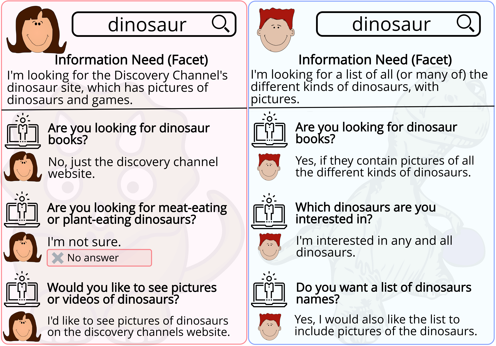

# Qulac
A dataset on asking Questions for Lack of Clarity in open-domain information-seeking conversations.

## Introduction
While searching on the Web, users often fail to formulate their
complex information needs in a single query. As a consequence, they
may need to scan multiple result pages or reformulate their queries.
Alternatively, systems can decide to proactively ask questions to
clarify users’ intent before returning the result list. In other
words, a system can assess the level of confidence in the results
and decide whether to return the results or ask questions from the
users to *clarify* their information need. The questions can be aimed to clarify ambiguous, faceted, or incomplete queries. The figure below illustrates one typical example of clarifying questions and their usefulness in a conversational search system:

We see that both users, Alice and Robin, issue the same query, “dinosaur.”
Assuming that the system does not have access to any prior personal
or contextual information, the conversation starts with the same
clarifying question. The rest of the conversation, however, depends
on the users’ responses. The users’ responses aid the system
to get a better understanding of the underlying information need.

Qulac presents the first dataset and offline evaluation framework for studying clarifying questions in open-domain information-seeking conversational search systems. Below we briefly explain how we collected data and provide further details on the provided data format.

## Data Collection
We have built Qulac on top of TREC Web Track 09-12 collections.
As such, we collected Qulac following a four-step strategy. In the first
step, we define the topics and their corresponding facets, which are borrowed from the TREC Web Track. In the
second step, we collected several candidates clarifying questions for each query through crowdsourcing. Then, in the third step,
we assessed the relevance of the questions to each facet and collected
new questions for those facets that require more specific questions.
Finally, in the last step, we collected the answers for every query-facet-question triplet. Some details of Qulac is listed below:

Feature  							| Value
------------------------------| -----
\# topics 						| 198
\# faceted topics 				| 141
\# ambiguous topics 			| 57
\# facets 						| 762
Average facet per topic 		| 3.85
Median facet per topic 			| 4 
\# informational facets 		| 577
\# navigational facets 			| 185
\# questions 						| 2,639
\# question-answer pairs 		| 10,277
Average terms per question 	| 9.49
Average terms per answer 		| 8.21

## Files
Below we list the files in the repository:

* `./data/qulac/qulac.json` consists of topics, facets, questions, and answers,
* `./data/qulac/qulac_hist012_dict.json` is a `dict` consisting of artificially generated conversations of 1, 2, and three turns.
* `./data/ql_evaluations/eval_hist012_dict.pkl` is a `dict` containing the result of query likelihood (QL) (see [1]) for all artificially generated conversations with and without answers. It consists of 11 evaluation metrics.
* `.data/bert_qpp_features/bert_qpp_dict.pkl` is a `dict` containing BERT representations together with QPP features (see [1]). This file can be used to reproduce the results of [1].

**NOTE:** Since `./data/ql_evaluations/eval_hist012_dict.pkl` and `.data/bert_qpp_features/bert_qpp_dict.pkl` are very large, we have stored them in binary (Pickle) for more efficient IO. Please contact us if you need them in any other formats.

**NOTE:** Due to the size of the files above, we have stored them on external servers. You can find the link to download the files in their respective directories.
  

## File Format

### `qulac.json`:

`qulac.json` contains the topics, facets, questions, and answers. This is the main file of Qulac. However, it may not be very straightforward to use this file for experiments directly. That is why we have provided some auxiliary data files which we describe in this document. In the `qulac.json` file, you will find these fields:

* `topic_id`: the ID of the topic in TREC Web Track.
* `facet_id`: the ID of the facet in TREC Web Track.
* `topic_facet_id`: an ID corresponding to a topic and facet pair in the following format: `%d-%d`. For example, `21-1` corresponds to the first facet (`facet_id`=1) of the 21st topic in TREC Web Track data.
* `topic_facet_question_id`: an ID corresponding to a topic, facet, and question triplet in the following format: `%d-%d-%d`. For example, `21-1-5` corresponds to the fifth question of the first facet of the 21st topic. Each row of the data is identified by this ID. 
* `topic`: the TREC topic (query).
* `topic_type`: an `str` value indicating the type of a topic. Possible values are `faceted` and `ambiguous`. 
* `facet_type`: an `str` value indicating the type of a facet. Possible values are `inf` (i.e., informational) and `nav` (i.e., navigational).
* `topic_desc`: a full description of the topic as it appears in the TREC Web Track data.
* `facet_desc`: a full description of the facet (information need) as it appears in the TREC Web Track data.
* `question`: a clarifying question that the system can pose to the user for the current topic and facet.
* `answer`: an answer to the clarifying question, assuming that the user is in the context of the current row (i.e., the user's initial query is `topic`, their information need is `facet`, and `question` has been posed to the user).

Below, you can find a few example rows of Qulac:

topic\_id | facet\_id | topic\_facet\_id | topic\_facet\_question\_id | topic | topic\_type | facet\_type | topic\_desc | facet\_desc | question | answer 
---------|---------|--------------|----------------------------|-------|-----------|--------|-----|--------|--------|--------
193|	2|	193-2|	193-2-5|	dog clean up bags|	faceted	|inf|	Can I order dog clean-up bags online?|	Are there biodegradable products for the dispo...|	are you looking for a way to dispose your dog ...|	im looking for dog waste bags that are biodegr...
144	|2	|144-2|	144-2-5	|trombone for sale|	ambiguous	|inf	|information on where I could buy a new or used...|	good places to sell a used trombone	|are you looking for a place to sell a used tro...|	yes
78	|3	|78-3	|78-3-7	|dieting	|ambiguous|	inf	|Find \"reasonable\" dieting advice, that is no...|	Find crash diet plans that promise quick weigh...|	do you want to know if dieting is safe|	i would like to know more on quick and safe di...

### `qulac_hist012_dict.tar.gz`:
`qulac_hist012_dict.tar.gz` can be used for experiments involving multi-turn conversations. As we have mentioned in [1], the conversations are artificially generated following the data that is available in `qulac.json`. Hence, the structure of the `dict` is as follows (after decompression):

	{ <record_id>: 
		{ 
		  'history_id': <the ID of conversation history (context)>,
		  'history_list': [
					{ 'question': <question1 string>,
					  'answer': <answer1 string> },
					{ 'question': <question2 string>,
					  'answer': <answer2 string> },
					{ 'question': <question2 string>,
					  'answer': <answer2 string> },		 					 
				    ],
		 'query': <query (topic) string>,
		 'question': <current question string>,
		 'answer': <current answer string>
	  }
	  ....
	}
	
As we see, each record is identified with an ID (`<record_id`) and is a key in the dictionary. Each item in the dictionary is itself a dictionary that consists of a list of past questions and answers exchanged in the conversation, as well as the topic, current question, and the current answer. There is also an item called `history_id` that is a unique identifier for the history. Below we see and example:

	 '18-2-1-2-10-1': {	 
		'history_id': '18-2-1-2',
		'history_list': [{'answer': 'no i just want to find spreadsheets and templates',
				'question': 'are you interested in a service for wedding budgeting'},
				{'answer': 'yes i want to find some spreadsheets to help me budget',
				'question': 'are you looking for advice on wedding budgeting'}],
		'query': 'wedding budget calculator',
		'question': 'what is your projected budget for your wedding',
		'answer': 'i need to find a spreadsheet to figure it out'},

	'25-1-3-8-1' : {	 
		'history_id': '25-1-3',
		'history_list': [{'answer': 'no i am looking for information on the greek mathematician euclid',
				'question': 'do you need directions to euclid ave'}],
		'query': 'euclid',
		'question': 'do you want to know related people',
		'answer': 'no i only want to know about one particular person'}
	 
### `eval_hist012_dict.pkl`:

This file contains the evaluation results of all possible combinations of questions and answers with 1, 2, and 3 turns. The retrieval is done using a modified QL model (see [1]) and evaluated on a modified TREC qrel file. The metrics are nDCG@1,3,5,10,20; P@1,3,5,10,20; MRR@100. The dictionary is formatted as follows:

	{ <metric_identifier> : <record_id> : <value> }
	
Here is a sample data:

	{'MRR100': {'20-2-1-0': 0.0,
		  '20-2-1-1': 0.0,
		  '20-2-10-0': 0.0,
		  '20-2-10-1': 0.0,
		  '20-2-11-0': 0.0,
		  '20-2-11-1': 1.0,
		  '20-2-12-0': 0.0,
		  '20-2-12-1': 0.0,
		  ...},
	  
	 'NDCG20': {'20-2-1-0': 0.0,
		 '20-2-1-1': 0.0,
		 '20-2-10-0': 0.0,
		 '20-2-10-1': 0.0,
		 '20-2-11-0': 0.0,
		 '20-2-11-1': 0.36252395084997224,
		 '20-2-12-0': 0.0,
		 '20-2-12-1': 0.0,
		 '20-2-13-0': 0.0,
		 '20-2-13-1': 0.24356187958225833,
		 '20-2-14-0': 0.0,
		 '20-2-14-1': 0.10773341865761957,
		 ...},
	 ...
	}
	 
**NOTE:** Relevant codes and qrel files to reproduce this `dict` will be added to the repository later.

### `bert_qpp_dict.pkl`:

We have provided the features and representations that we used in [1] for reproducibility. Hence, this file contains a `dict` as follows:

	<record_id> : {
			'query_facet_id': <same as topic_facet_id in qulac.json>,
			'query': <BERT representation of the query (topic)>,
			'question': <BERT represenation of the question>,
			'history_list': [
					<BERT representation of the first question answer pair in the context>,
					<BERT representation of the second question answer pair in the context>,
					<BERT representation of the third question answer pair in the context>
					],
			'history_len': <number of turns in the conversation history (context)>,
			'scores': <the scores of top ranked documents after running the modified QL using query, history, and question>,
			'scores_std': <standard deviation of top k scores>
		}
					
Below we see a sample:

	{ '1-2-2-1-1': 
		{
			'history_len': 1,
			'history_list': [[0.12686,
					   -0.60192,
					   -0.208874,
					   0.001408,
					   -0.036675,
					   0.023856,
					   -0.274937,
					   ...]],
			'query': 	[-0.607881,
					  -0.918204,
					  -0.162166,
					  -0.850832,
					  0.403656,
					  0.551275,
					  0.141782,
					  0.89388,
					  0.517192,
					  ...],
			'query_facet_id': '1-2',
			'question': 	[-0.683592,
					  -0.436706,
					  -0.881163,
					  -0.154672,
					  0.321163,
					  -0.110311,
					  -0.010973,
					  1.051107,
					  0.244392,
					  ...],
			'scores': 	[-5.979888569396179,
					  -6.4430787788018495,
					  -6.444356256703669,
					  -6.4445699080820775,
					  -6.444756161165571,
					  -6.517334331640069,
					  -6.588618185924115,
					  -6.618846047988905,
					  -6.627880109313763,
					  ...],
			'scores_std': 	[0.0,
					  0.32752493804996663,
					  0.2677925299530175,
					  0.23205747316634495,
					  0.20764307553239575,
					  0.19770034752952462,
					  0.1971001297433477,
					  0.19699259692169363,
					  ...]
		}
		...
	}
						  
## Record ID

As you might have noticed, every record is identified with a long ID. The ID's are unique and easy-to-read. Below we describe the format of the ID's and provide a two simple Python functions to encode and decode ID's. Each ID is formated as follow:

    topic_id - facet_id - past_question_id_1 - past_question_id_2 - current_question_id - answer_flag
    
Therefore, an ID starts with the topic and facet ID's, followed by a maximum of two numbers referring to the ID's of past questions in the conversation history (context). Further, the ID of the current question is mentioned, followed by a binary flag. The flag is used to indicate whether the record is referring to the results that are obtained with (=1) or without (=0) final answer. Below we see some examples:

* `18-2-1-2-10-1`: In this example, we see a record that is from the 18th topic and its 2nd facet. The conversation context consists of two past questions with ID's 1 and 2. The current question's ID is 10. Finally, we see that the answer flag is 1, which means that the corresponding values of this record are computed with the answer. The answer flag is mainly used in the `eval_dict.pkl` file where we have the evaluated results of modified QL on multiple evaluation metrics. For instance, in this case, `18-2-1-2-10-0` refers to the exact record, but the QL model has been executed without having access to the answer, while `18-2-1-2-10-1` is the final result with the answer and is used to evaluate the performance of different models after they select certain questions. 
* `18-2-10-1`: This is an example of the same topic, facet, and question. The difference here is that the conversation has no prior question and answers. It is the first turn of a conversation.

### Code snippets:

To help to decode the ID's we have also provided two simple code snippets that can be used for understanding the ID's in your code.

	def encode_id(topic_id, facet_id, hisotry_ids, question_id, with_ans):
	    rec_id = '{}-{}'.format(topic_id,facet_id)
	    for hid in hisotry_ids:
	        rec_id += '-{}'.format(hid)
	    rec_id += '-{}-{}'.format(question_id, with_ans)
	    return rec_id
    
    def decode_id(rec_id):
	    tokens = rec_id.split('-')
	    topic_id, facet_id, question_id, with_ans = tokens[0], tokens[1], tokens[-2], tokens[-1]
	    hisotry_ids = ()
	    for k in range(2,2+len(tokens)-4):    
	        hisotry_ids += (tokens[k],)
	    return topic_id, facet_id, hisotry_ids, question_id, with_ans
		

## Citation

Please consider citing our paper if you use Qulac in your research:

	@inproceedings{AliannejadiSigir19,
	    author    = {Aliannejadi, Mohammad and Zamani, Hamed and Crestani, Fabio and Croft, W. Bruce},
	    title     = {Asking Clarifying Questions in Open-Domain Information-Seeking Conversations},
	    booktitle = {International {ACM} {SIGIR} Conference on Research and Development in Information Retrieval (SIGIR)},
	    series    = {{SIGIR '19}},
	    location  = {Paris, France},          
	    year      = {2019}
  	}
  	
## Acknowledgments

This work was a joint effort by Università della Svizzera italiana (USI), Lugano, Switzerland and University of Massachusetts Amherst, Amherst, MA, USA. Thanks to Mohammad Aliannejadi, Hamed Zamani, Fabio Crestani and W. Bruce Croft for their efforts in developing this dataset.
Finally, we would like to thank the expert annotators and crowd workers for their invaluable help in creating Qulac.
  
  
## References

[1] M. Aliannejadi, H. Zamani, F. Crestani, and W. B. Croft, Asking Clarifying Questions in Open-Domain Information-Seeking Conversations, International ACM SIGIR Conference on Research and Development in Information Retrieval (SIGIR), Paris, France, 2019.
